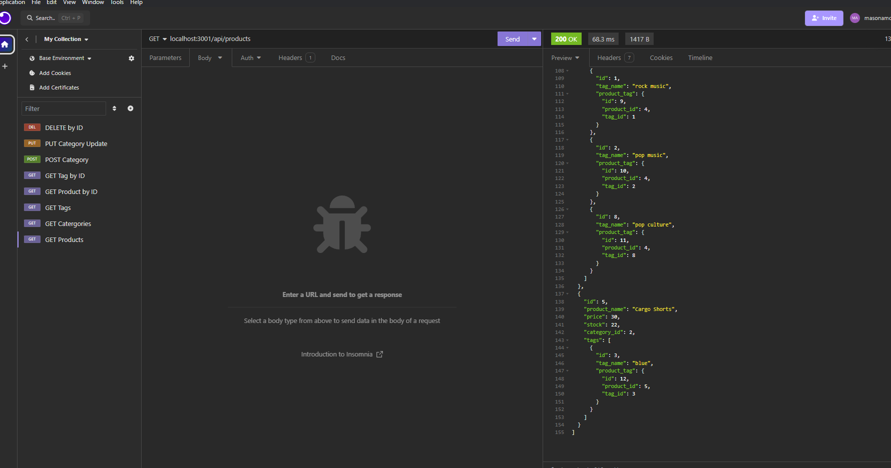

# Back End Ecommerce

## Description

This is a backend app for handling an ecommerce website. You can add products, categories and tags. You can also update and delete as well.

## Table of Contents

1. [Installation](#installation)
2. [Usage](#usage)
3. [License](#license)
4. [Contributing](#contributing)
5. [Tests](#tests)
6. [Questions](#questions)

## Installation

Go to github repo and clone on to your computer.

## Usage

1. Run mysql -u root to and use the database 2. Run npm run seed to seed the data base with the info 3. Run npm i to start the server on localhost:3001.

## License

This project is licensed under the MIT license. See the [MIT License]([License](https://opensource.org/licenses/MIT)) for details.

## Contributing

n/a

## Tests

Test all routes on Insomnia

## Questions

For questions about the project, please feel free to contact me via GitHub: [masonamc5](https://github.com/masonamc5) or via email at masonamc5@gmail.com.
